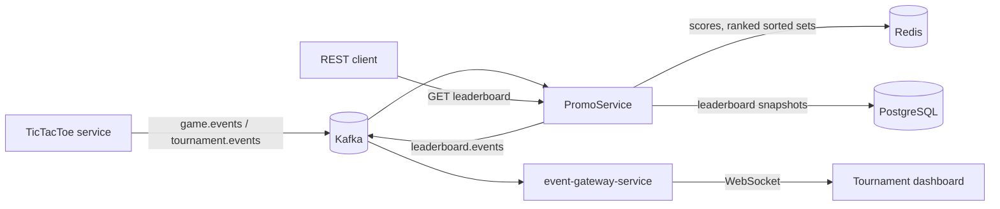

# PromoService


An event-driven Spring Boot microservice that turns a stream of game results into live tournament leaderboards.
It listens to game and tournament events on Kafka, scores every player, keeps a ranked leaderboard in Redis,
stores snapshots in PostgreSQL, publishes leaderboard updates back to Kafka, and serves the leaderboard over REST.

## How it fits together



1. `TournamentEventSubscriber` marks a tournament as active when a `STARTED` event arrives.
2. `GameEventSubscriber` scores every `FINISHED` game: win = 3, draw = 1, loss = 0 (`ScoreService`, a thread-safe `ConcurrentHashMap` with `merge`).
3. Every 10 seconds `LeaderboardService` (a `@Scheduled` job) writes each active tournament's scores to a Redis sorted set,
   persists a snapshot (average score + top three) to PostgreSQL, and publishes a `LeaderboardEvent` to `leaderboard.events`.
4. The REST API reads the ranking straight from Redis.

## REST API

| Method | Path | Returns |
| --- | --- | --- |
| GET | `/tournament/{tournamentId}/leaderboard/top/{n}` | Top `n` players with score and rank |
| GET | `/tournament/{tournamentId}/leaderboard/all` | Full ranking |

An unknown or inactive tournament returns **404** with a JSON error body (`GlobalExceptionHandler`).
Path variables are validated (`@NotBlank`, `@Positive`). OpenAPI docs: `http://localhost:8084/swagger-ui.html`.

## Tech

Java 21 · Spring Boot 3.5 · Spring Kafka (consumer groups, 3 listener threads per topic) · Spring Data Redis (sorted sets) ·
Spring Data JPA / Hibernate · PostgreSQL · springdoc-openapi · Lombok · Docker (multi-stage build).

Event contracts (`GameEvent`, `TournamentEvent`) come from the shared [promobridge-sdk](https://github.com/StefanBelc/promobridge-sdk).

## Running it

Requirements: JDK 21 (`mvn -v` must show Java 21), Maven, Docker.

```bash
# 1. Install the shared SDK (not published to Maven Central)
git clone --branch 4.5 https://github.com/StefanBelc/promobridge-sdk.git
mvn -f promobridge-sdk/pom.xml install -DskipTests

# 2. Start Kafka, Schema Registry, PostgreSQL and Redis
#    (see https://github.com/StefanBelc/promo-infrastructure)

# 3. Run the service (port 8084)
mvn spring-boot:run
```

The schema is validated at startup (`ddl-auto: validate`), so the `leaderboard` and `leaderboard_top_players`
tables must exist. Versioned migrations with Flyway are the planned next step.

## Tests

```bash
mvn verify   # needs Docker running
```

- **Unit:** `LeaderboardControllerUnitTest` (controller with a mocked service).
- **Integration (Testcontainers):** real Kafka, Redis and a throwaway PostgreSQL; `LeaderboardServiceIntegrationTest`
  checks a leaderboard event is published end to end, `LeaderboardControllerIntegrationTest` calls the REST API with RestAssured.
- CI runs the full suite on every push and pull request (GitHub Actions, JDK 21).

## Next steps

- Flyway migrations instead of a hand-made schema
- Dead-letter topic and retry/back-off for events that fail processing
- Spring Boot Actuator health and metrics endpoints
- Keep scores in Redis only, so several instances can share them
